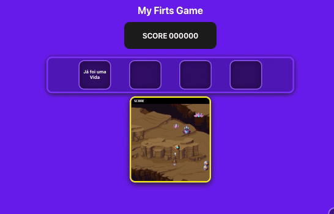

# My first Game

The ideia with that project is blend Reactjs and Phaser.js, create a game that updates website elements.

## Result

#
## Prerequisites

> has node.js installed

#

## Install and Use

### Installing

Run in your terminal

> npm install

### Using 

Run inn your terminal

> npm start

It will open in your navegator.

#

if you liked the idea, let a :star: , thank you :blush: